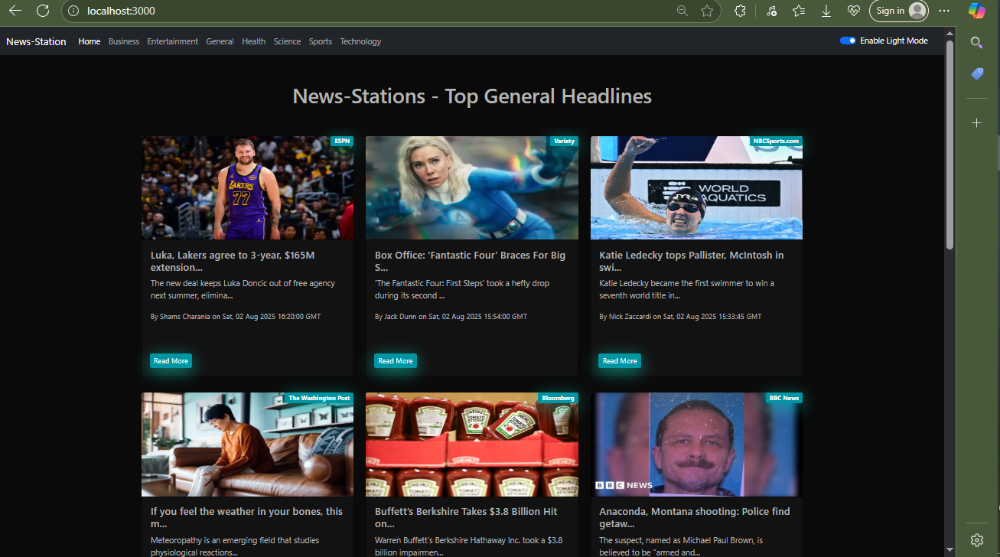
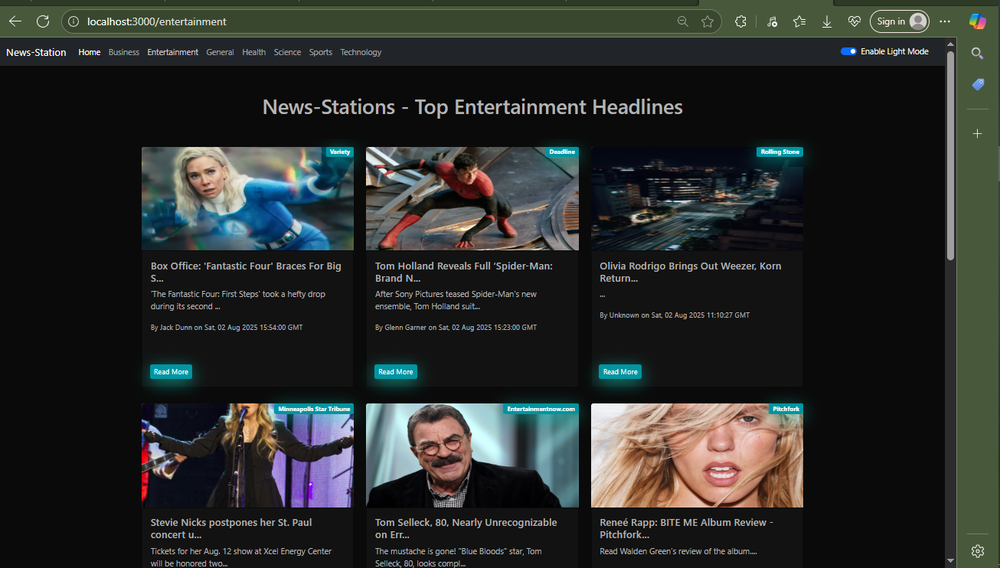
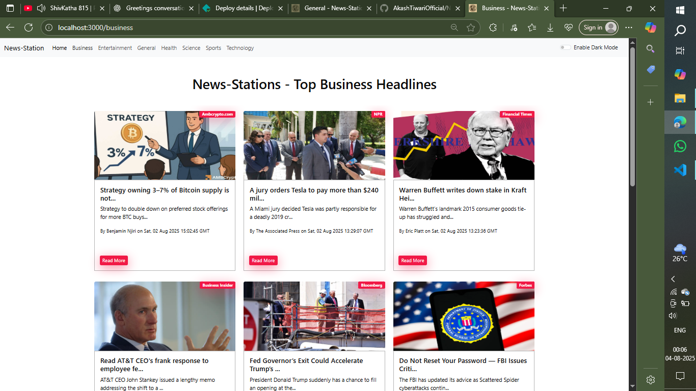
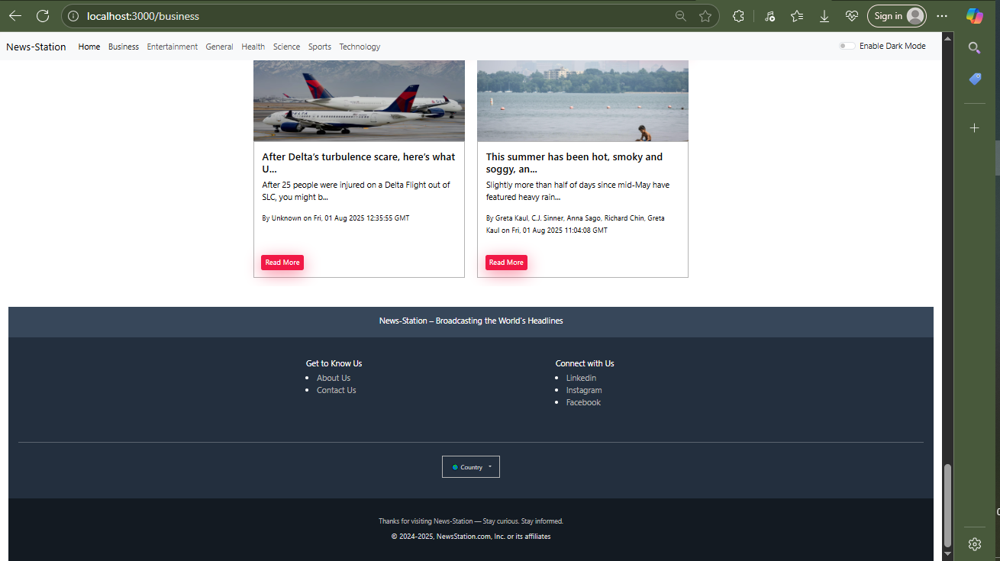
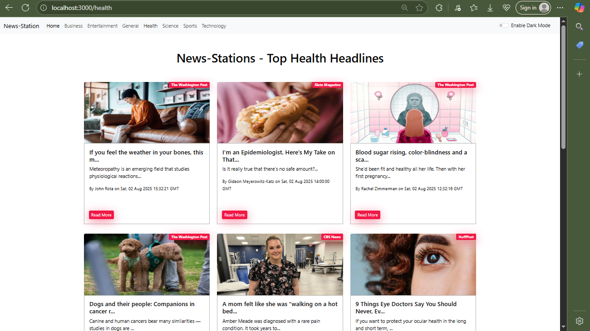

# 📰 News Station - React News App

### A responsive React web app that fetches real-time news headlines using NewsAPI.org

---


## 🖼️ Screenshots

### 🏠 Homepage


### 🌙 Dark Mode


### 🚨  Light Mode  


### Footer


### Other-page


---


## 🚀 Features

- 🌍 Browse top headlines by **country** and **category**
- 🔁 Seamless **Infinite Scroll** to load more news
- 🌗 Light & Dark **Mode Toggle**
- ⏳ Loading indicator with **progress bar**
- 🧠 Graceful fallback UI for unavailable regions
- 🔐 API Key auto-switching to handle quota limits
- 📦 Powered by [NewsAPI.org](https://newsapi.org)

---

## 🛠 Tech Stack

- **Frontend:** React JS
- **Routing:** React Router
- **Infinite Scroll:** `react-infinite-scroll-component`
- **Environment Config:** `.env` for API keys
- **Styling:** Bootstrap & Custom CSS

---

## 🔑 API Setup

To use this app, you need an API key from [NewsAPI.org](https://newsapi.org).

1. Create a `.env` file in the project root.
2. Add your API keys like this:

```env
REACT_APP_NEWS_API_1=your_api_key_1
REACT_APP_NEWS_API_2=your_api_key_2
REACT_APP_NEWS_API_3=your_api_key_3
REACT_APP_NEWS_API_4=your_api_key_4

 The app will auto-switch between these API keys if one gets exhausted.

---

🚀 Getting Started (Local)
Clone the repository

git clone https://github.com/your-username/news-station.git
cd news-station
Install dependencies

npm install
Add your .env file (see above)

Start the app

npm start

---

## 

Due to NewsAPI’s free plan restriction, the app cannot be hosted publicly without a paid (developer) plan. Netlify and other hosting platforms will fail the build due to API access denial at runtime.

To test or use this project:

Clone locally

Add your API keys

Run in development mode (npm start)

🔗 Live Demo (Localhost Only)
Since API hosting requires a paid plan, this app runs only on local development environments. A demo cannot be hosted on Netlify unless upgraded.